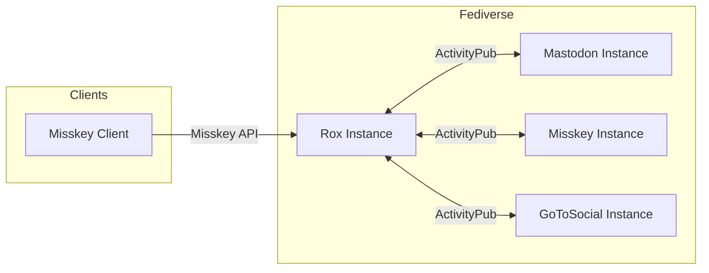

# The Modern React Stack Behind Rox - A Lightweight ActivityPub Server

> [!NOTE]
> This article is Day 11 of the [React Tokyo Advent Calendar 2025](https://qiita.com/advent-calendar/2025/react-tokyo).

## Introduction

Hi there! I'm SASAPIYO.

I spend my time doing programming, design, and video production, while also serving as a **Community Supporter for React Tokyo**. React Tokyo is a community for those interested in React. We're active both online and offline, providing opportunities for knowledge sharing and networking through meetups and events.

Earlier this year, I attended an **AI Coding Workshop** at React Tokyo's hot spring retreat, and the inspiration I gained there led me to start a new project.

That project is **Rox**, a lightweight ActivityPub server and client.

## What is Rox?

ActivityPub is a federation protocol used by decentralized social networks like Mastodon and Misskey. Rox implements this protocol while also maintaining compatibility with the Misskey API.

It's important to note that Rox **isn't meant to compete with Misskey**. Rather, we're aiming for **coexistence**.

- Want the best parts of Misskey without all the features?
- Need a lightweight, simple server?
- Want to customize it to your liking?

For people like this, we're considering a **plugin-based** approach to feature expansion. The idea is to let you pick and choose only the features you need.

Another thing we're conscious of with Rox is **actively adopting technologies born in Japan**. We're building this project using excellent Japanese-made technologies like Waku, Jotai, and Hono.

Let's take a look at the technology stack we're using in Rox!

## Technology Stack Overview

| Layer | Technology |
|-------|------------|
| Frontend Framework | **Waku** (React Server Components) |
| State Management | **Jotai** |
| UI Components | **React Aria Components** |
| Backend | **Hono** |
| ORM | Drizzle ORM |
| Runtime | Bun |

## Waku - React Server Components Framework

### Why Waku?

Rox's frontend uses Waku, a lightweight framework with native support for React Server Components (RSC).

```tsx
// Page component example in Waku
export default async function NotePage({ id }: { id: string }) {
  // Fetch data on the server side
  const note = await fetchNote(id);
  
  return (
    <div>
      <NoteContent note={note} />
      <NoteActions noteId={id} /> {/* Client Component */}
    </div>
  );
}
```

**Why we chose it:**
- Great compatibility with React 19
- First-class Server Components support
- Small bundle size
- Simple API

> [!TIP]
> By the way, the [Rox official website](https://love-rox.cc) is also built with Waku! We're using it for static generation of our blog and documentation too.

## Jotai - Atomic State Management

### Simple Yet Powerful State Management

Rox uses Jotai for state management, a library that manages state in units called "atoms".

```typescript
import { atom, useAtom } from 'jotai';

// Current user info as an atom
export const currentUserAtom = atom<User | null>(null);

// Timeline state
export const timelineAtom = atom<Note[]>([]);

// Usage in components
function UserProfile() {
  const [user] = useAtom(currentUserAtom);
  return <div>{user?.displayName}</div>;
}
```

**What's great about Jotai:**
- Minimal boilerplate
- Great TypeScript compatibility
- Natural Suspense integration
- Re-renders only what's needed

## React Aria Components - Accessibility First

### Headless UI Components

Rox uses React Aria Components for its UI.

```tsx
import { Button, Dialog, Modal } from 'react-aria-components';

function ConfirmDialog() {
  return (
    <Modal>
      <Dialog>
        <h2>Confirm</h2>
        <p>Are you sure you want to proceed?</p>
        <Button>Yes</Button>
        <Button>Cancel</Button>
      </Dialog>
    </Modal>
  );
}
```

**Why we chose it:**
- WAI-ARIA compliant accessibility
- High styling flexibility
- Keyboard navigation support
- Internationalization (i18n) support

### Considering Yamada UI

In line with our goal of using Japanese technologies, we're also considering adopting **Yamada UI**.

Yamada UI is a React component library from Japan with these attractive features:
- Rich pre-built components
- Dark mode support
- Animation features
- Comprehensive Japanese documentation

We're exploring a configuration that leverages both React Aria Components' low-level control and Yamada UI's development efficiency.

## Hono - Ultra-Fast Backend

### Frontend Integration

Rox's backend uses Hono, an ultra-lightweight and fast web framework.

```typescript
import { Hono } from 'hono';

const app = new Hono();

app.get('/api/notes/:id', async (c) => {
  const noteRepository = c.get('noteRepository');
  const note = await noteRepository.findById(c.req.param('id'));
  
  if (!note) {
    return c.json({ error: 'Not found' }, 404);
  }
  
  return c.json(note);
});
```

**Why we chose Hono:**
- Excellent compatibility with Bun
- Web Standards API based
- TypeScript first
- Rich middleware ecosystem

## ActivityPub Federation

### Server-to-Server Communication

The ActivityPub protocol is a mechanism for sharing content between servers.



Rox:
- Federates with Mastodon, GoToSocial, and more via **ActivityPub**
- Compatible with existing Misskey clients via **Misskey API**

The React frontend works with this backend to provide real-time timeline display and posting features.

## Project Structure

### Monorepo Setup

```
rox/
├── packages/
│   ├── backend/   # hono-rox (API Server)
│   ├── frontend/  # waku-rox (Web Client)
│   └── shared/    # Shared type definitions
└── ...
```

We're using a Bun-based monorepo setup, sharing types between frontend and backend.

We've given our packages some loving names:
- **hono-rox**: Hono-based backend
- **waku-rox**: Waku-based frontend

## Summary

Rox uses the following technology stack:

- **Waku**: Efficient rendering with React Server Components
- **Jotai**: Simple yet powerful atomic state management
- **React Aria Components**: Accessibility-first UI
- **Hono**: Fast and lightweight backend
- **Yamada UI**: Under consideration for future adoption

By combining these modern React technologies, we're able to develop a complex application like a decentralized social network in a simple way.

## Want to Try Rox?

Rox is still in development, but if you're interested, please check it out!

- Browse the official website
- Take a look at the source code on GitHub
- Participate in development through Issues or Pull Requests

**Contributions are very welcome!** Want to build a lightweight ActivityPub server together?

---

## Links

- **Rox Official Website**: [https://love-rox.cc](https://love-rox.cc)
- **GitHub**: [Love-Rox/rox](https://github.com/Love-Rox/rox)
- **React Tokyo**: [https://react-tokyo.vercel.app/](https://react-tokyo.vercel.app/)

---

**See you in tomorrow's Advent Calendar!**
