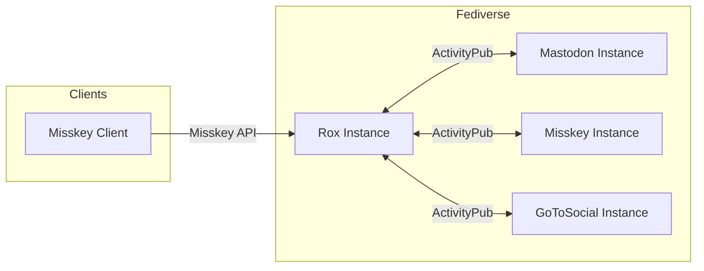

# 軽量ActivityPubサーバー「Rox」を支えるモダンReact技術スタック

> [!NOTE]
> この記事は [React Tokyo Advent Calendar 2025](https://qiita.com/advent-calendar/2025/react-tokyo) 11日目の記事です。

## はじめに

こんにちは！ささぴよと申します。

普段はプログラミング・デザイン・映像制作などをしながら、**React Tokyo**のコミュニティサポーターもしています。React Tokyoは、Reactに関心のあるメンバーが集まるコミュニティです。オンラインとオフラインの両方で活動しており、勉強会やイベントを通じて情報交換やつながりづくりの場を提供しています。

実は今年、React Tokyoの温泉合宿で開催された**AIコーディングワークショップ**に参加したのですが、そこで得たインスピレーションがきっかけで、新しいプロジェクトを始めることにしました。

それが**Rox**という軽量ActivityPubサーバー・クライアントです。

## Roxって何？

ActivityPubは、MastodonやMisskeyなどの分散型SNSで採用されている連合プロトコルです。RoxはこのActivityPubを実装しつつ、Misskey APIとの互換性も持たせた新しいサーバー実装です。

ここで大事なのは、Roxは**Misskeyに対抗するためのプロジェクトではない**ということ。むしろ**共存**を目指しています。

- Misskeyほどの多機能は要らないけど、おいしいとこ取りをしたい
- 軽量でシンプルなサーバーが欲しい
- 自分好みにカスタマイズしたい

そんな方のために、**プラグイン方式**での機能拡張も検討しています。必要な機能だけを選んで使えるようにするイメージですね。

もうひとつRoxで意識しているのは、**日本発の技術を積極的に採用する**こと。WakuやJotai、Honoなど、日本から生まれた素晴らしい技術を活用してプロジェクトを作り上げています。

では、Roxで採用している技術スタックを見ていきましょう！

## 技術スタック概要

| Layer | Technology |
|-------|------------|
| Frontend Framework | **Waku** (React Server Components) |
| State Management | **Jotai** |
| UI Components | **React Aria Components** |
| Backend | **Hono** |
| ORM | Drizzle ORM |
| Runtime | Bun |

## Waku - React Server Componentsフレームワーク

### なぜWakuを選んだのか

RoxのフロントエンドにはWakuを採用しています。Wakuは、React Server Components (RSC) をネイティブサポートする軽量フレームワークです。

```tsx
// Wakuでのページコンポーネント例
export default async function NotePage({ id }: { id: string }) {
  // サーバーサイドでデータ取得
  const note = await fetchNote(id);
  
  return (
    <div>
      <NoteContent note={note} />
      <NoteActions noteId={id} /> {/* Client Component */}
    </div>
  );
}
```

**選定理由：**
- React 19との相性が良い
- Server Componentsのファーストクラスサポート
- バンドルサイズが小さい
- シンプルなAPI

> [!TIP]
> ちなみに、[Rox公式サイト](https://love-rox.cc)もWakuで構築しています！ブログやドキュメントの静的生成にもWakuを活用していますよ。

## Jotai - アトミックな状態管理

### シンプルで強力な状態管理

Roxでは状態管理にJotaiを採用しています。Jotaiは「atom」という単位で状態を管理するライブラリです。

```typescript
import { atom, useAtom } from 'jotai';

// 現在のユーザー情報をatom化
export const currentUserAtom = atom<User | null>(null);

// タイムラインの状態
export const timelineAtom = atom<Note[]>([]);

// コンポーネントでの使用
function UserProfile() {
  const [user] = useAtom(currentUserAtom);
  return <div>{user?.displayName}</div>;
}
```

**Jotaiの良いところ：**
- ボイラープレートが少ない
- TypeScriptとの相性が良い
- Suspenseとの統合が自然
- 必要な部分だけ再レンダリング

## React Aria Components - アクセシビリティファースト

### ヘッドレスUIコンポーネント

RoxのUIコンポーネントにはReact Aria Componentsを採用しています。

```tsx
import { Button, Dialog, Modal } from 'react-aria-components';

function ConfirmDialog() {
  return (
    <Modal>
      <Dialog>
        <h2>確認</h2>
        <p>この操作を実行しますか？</p>
        <Button>はい</Button>
        <Button>キャンセル</Button>
      </Dialog>
    </Modal>
  );
}
```

**選定理由：**
- WAI-ARIA準拠のアクセシビリティ
- スタイルの自由度が高い
- キーボードナビゲーション対応
- 国際化（i18n）サポート

### Yamada UIも検討中

日本発の技術を活用するという方針もあり、**Yamada UI**の導入も検討しています。

Yamada UIは日本発のReactコンポーネントライブラリで、以下の点が魅力的です：
- 豊富なプリビルトコンポーネント
- ダークモード対応
- アニメーション機能
- 日本語ドキュメントの充実

React Aria Componentsの低レベルな制御と、Yamada UIの開発効率、どちらの良さも活かせる構成を模索しています。

## Hono - 超高速バックエンド

### フロントエンドとの統合

RoxのバックエンドにはHonoを採用しています。Honoは超軽量・高速なWebフレームワークです。

```typescript
import { Hono } from 'hono';

const app = new Hono();

app.get('/api/notes/:id', async (c) => {
  const noteRepository = c.get('noteRepository');
  const note = await noteRepository.findById(c.req.param('id'));
  
  if (!note) {
    return c.json({ error: 'Not found' }, 404);
  }
  
  return c.json(note);
});
```

**Honoを選んだ理由：**
- Bunとの相性が抜群
- Web標準APIベース
- TypeScript first
- ミドルウェアが豊富

## ActivityPub連合との統合

### サーバー間通信

ActivityPubプロトコルは、サーバー間でコンテンツを共有するための仕組みです。



Roxは：
- **ActivityPub**でMastodon、GoToSocialなどと連合
- **Misskey API**で既存のMisskeyクライアントと互換

Reactフロントエンドは、このバックエンドと連携してリアルタイムなタイムライン表示や投稿機能を提供しています。

## プロジェクト構成

### モノレポ構成

```
rox/
├── packages/
│   ├── backend/   # hono-rox (APIサーバー)
│   ├── frontend/  # waku-rox (Webクライアント)
│   └── shared/    # 共通型定義
└── ...
```

Bunを使用したモノレポ構成で、フロントエンド・バックエンド間で型を共有しています。

パッケージには愛着を込めて名前をつけています：
- **hono-rox**: Honoベースのバックエンド
- **waku-rox**: Wakuベースのフロントエンド

## まとめ

Roxでは以下の技術スタックを採用しています：

- **Waku**: React Server Componentsによる効率的なレンダリング
- **Jotai**: シンプルで強力なアトミック状態管理
- **React Aria Components**: アクセシビリティファーストなUI
- **Hono**: 高速で軽量なバックエンド
- **Yamada UI**: 今後導入を検討中

これらのモダンなReact技術を組み合わせることで、分散型SNSという複雑なアプリケーションをシンプルに開発できています。

## Roxを使ってみませんか？

Roxはまだ開発中ですが、興味を持っていただけたらぜひ触ってみてください！

- 公式サイトを眺めてみる
- GitHubでソースコードを覗いてみる
- Issueやプルリクエストで開発に参加する

**コントリビューションも大歓迎です！** 一緒に軽量ActivityPubサーバーを作っていきませんか？

---

## リンク

- **Rox公式サイト**: [https://love-rox.cc](https://love-rox.cc)
- **GitHub**: [Love-Rox/rox](https://github.com/Love-Rox/rox)
- **React Tokyo**: [https://react-tokyo.vercel.app/](https://react-tokyo.vercel.app/)

---

**明日のアドベントカレンダーもお楽しみに！**
